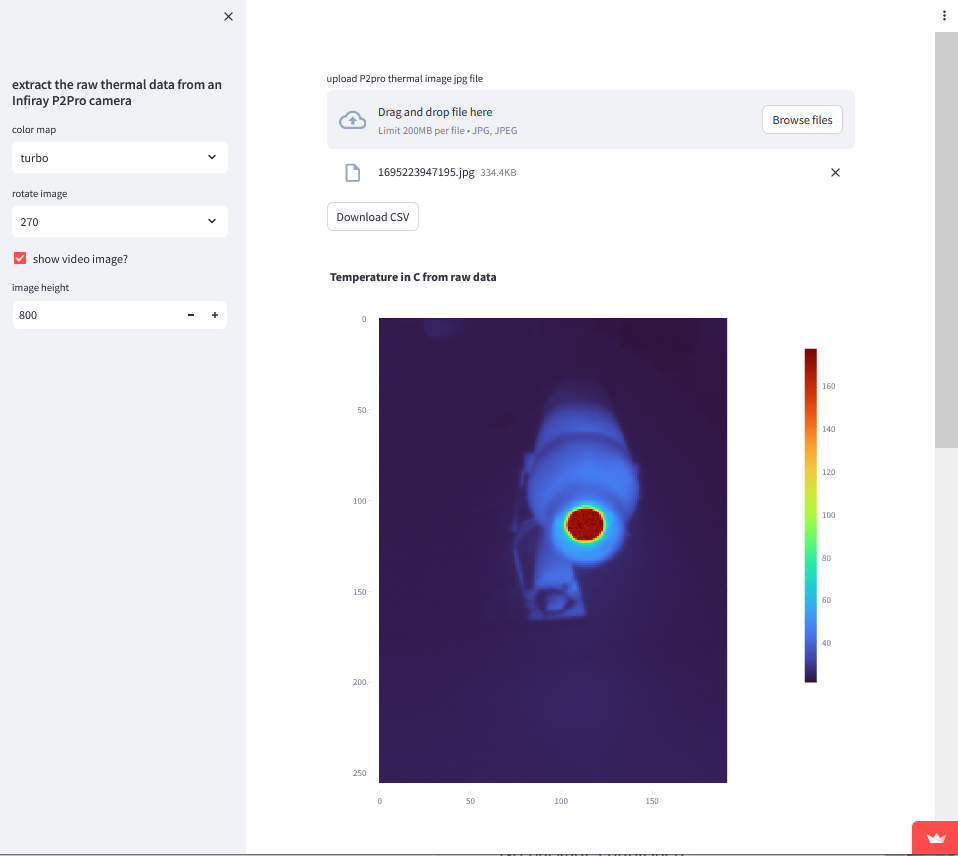

# p2proviewer
- extract the raw data out of Infiray P2Pro thermal camera jpeg images
- visualize data
- save temperature data as csv file
- temperature in Celsius
- set a manual temperature range
- T in C or F
- on the sidebar menu one can access a multi file csv conversion tool
- streamlit app (`pip install streamlit`) [Streamlit • A faster way to build and share data apps](https://streamlit.io/). Start the script with `streamlit run app.py`

💡 a quick tip:
You can open the downloaded csv image file in [ImageJ](https://imagej.net/software/imagej/) (`file->import text image`) and do more interesting things directly with the temperature data. Linescan profiles for example.

[live version of the app](https://p2proviewer.streamlit.app/)

